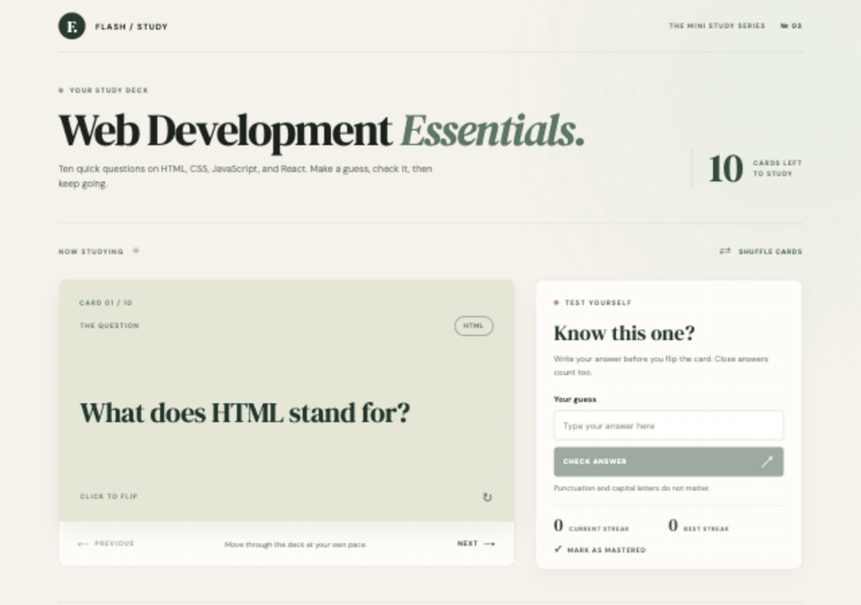

# Web Development Project 3 - Web Development Essentials

Submitted by: **Yudhiishbala Senthilkumar**

This web app: **A flashcard deck for practicing HTML, CSS, JavaScript, and React. You can guess an answer before flipping the card, work through the deck in order, and set aside cards you have mastered.**

Time spent: **5+** hours spent in total

## Required Features

The following **required** functionality is completed:

- [x] **The user can enter their guess into an input box before seeing the flipside of the card**
  - The input box is labeled "Your guess" and has a Check Answer button
  - A wrong answer shows a red input border and a message to try again
  - A correct answer shows a green input border and a success message
- [x] **The user can navigate through an ordered list of cards**
  - Next moves to the following card in the deck
  - Previous returns to the card before it
  - Previous is disabled on the first card and Next is disabled on the last card

The following **optional** features are implemented:

- [x] Users can shuffle the cards
  - Cards stay in their original order until Shuffle Cards is clicked
  - Shuffle Cards changes the order of the cards left in the deck
- [x] Answers can count as correct when they are slightly different
  - Capital letters and punctuation do not matter
  - Some cards accept shorter answers, such as "main" for `<main>`
- [x] The app shows the current and best streaks
  - A correct answer adds one to the current streak
  - A wrong answer resets the current streak to zero
  - The best streak keeps the highest count from the session
- [x] Users can mark cards as mastered
  - Mark as Mastered removes the current card from the study deck
  - Mastered questions appear in a list below the deck

The following **additional** features are implemented:

- [x] Guess text, feedback, and the flipped side reset when you change cards
- [x] The deck can be restored after every card is mastered
- [x] The card can be flipped with a keyboard
- [x] The layout works on smaller screens

## Video Walkthrough

Here's a walkthrough of the implemented features:



GIF created with browser screenshots and FFmpeg.

## Notes

The main challenge was keeping each question's input and flipped side from carrying over to the next card. I reset both when moving through the deck, shuffling, or marking a card as mastered. I also kept track of the card's place in the list after removing it.

## Run Locally

```bash
npm install
npm run dev
```

## License

    Copyright 2026 Yudhiishbala Senthilkumar

    Licensed under the Apache License, Version 2.0 (the "License").
    You may not use this file except in compliance with the License.
    You may obtain a copy of the License at

        http://www.apache.org/licenses/LICENSE-2.0

    Unless required by applicable law or agreed to in writing, software
    distributed under the License is distributed on an "AS IS" BASIS,
    WITHOUT WARRANTIES OR CONDITIONS OF ANY KIND, either express or implied.
    See the License for the specific language governing permissions and
    limitations under the License.
